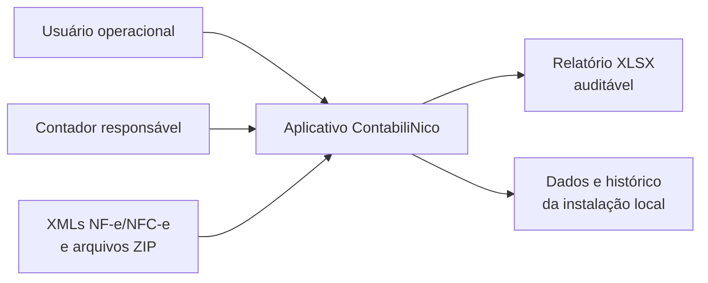
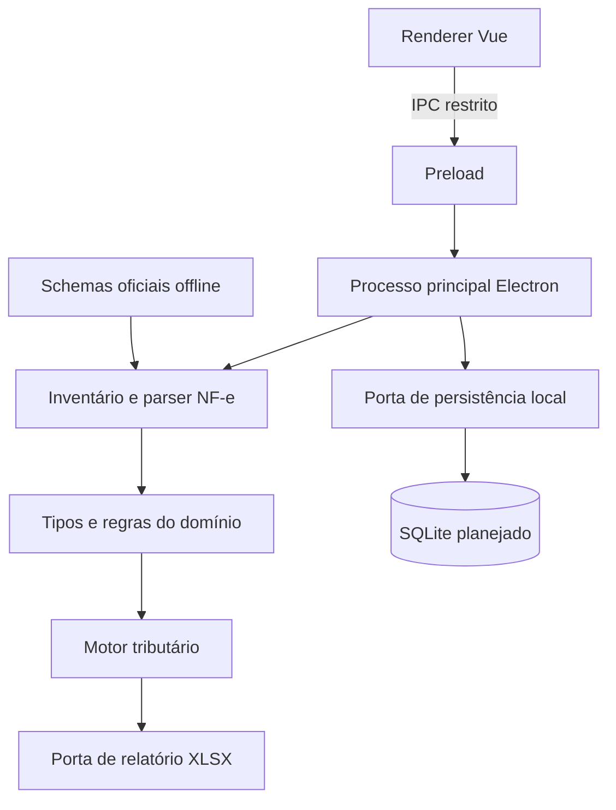
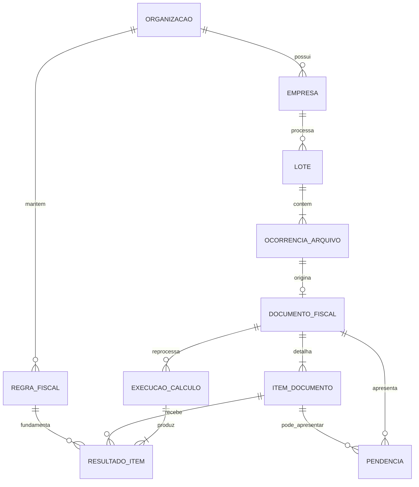

# Software Design Document — Arquitetura

**Projeto:** ContabiliNico
**Versão:** 0.1.0 — arquitetura em evolução
**Última atualização:** 16/09/2026

> Este documento é a visão acadêmica resumida da arquitetura. As decisões e
> contratos aprofundados permanecem em `arquitetura-inicial.md`,
> `modelo-de-dados.md` e `decisoes-tecnicas.md`.

## 1. Direcionadores

- processamento local de documentos fiscais sensíveis;
- funcionamento sem serviço externo obrigatório para o cálculo;
- cálculo determinístico, auditável e reproduzível;
- regras fiscais versionadas e separadas dos dados declarados no XML;
- falha de um arquivo isolada das demais ocorrências do lote;
- interface responsiva durante parsing e cálculo intensivos;
- possibilidade de substituir persistência e relatório sem acoplar o domínio.

## 2. Contexto do sistema



O aplicativo recebe documentos fornecidos pelo usuário, processa tudo localmente
e entrega resultado e evidências. O MVP não consulta automaticamente a SEFAZ nem
envia XMLs a terceiros.

## 3. Visão de componentes



### Responsabilidades

| Componente | Responsabilidade |
| :--- | :--- |
| `apps/desktop` | Janela, navegação, isolamento do renderer e coordenação pelo processo principal |
| `packages/contracts` | Contratos compartilhados de IPC |
| `packages/domain` | Vocabulário normalizado e estados independentes da interface |
| `packages/nfe-parser` | Inventário, segurança, parsing, XSD, normalização e diagnósticos |
| `packages/tax-engine` | Seleção determinística e futuro cálculo tributário |
| `packages/database` | Portas de persistência e futuras migrações locais |
| `packages/reporting` | Modelo e futura geração do XLSX |

## 4. Organização do monorepo

```text
apps/
  desktop/            Electron + Vue
packages/
  contracts/          contratos IPC
  database/           portas de persistência
  domain/             conceitos e estados fiscais
  nfe-parser/         ingestão e normalização
  reporting/          relatórios
  tax-engine/         seleção e cálculo
docs/                 produto, arquitetura e decisões
```

O gerenciador é pnpm workspaces. TypeScript usa configuração estrita comum e cada
pacote expõe apenas sua porta pública.

## 5. Modelo conceitual



Relações, campos e restrições completos estão em
[Modelo de dados inicial](modelo-de-dados.md).

## 6. Fluxo principal

1. O processo principal recebe arquivos selecionados por IPC.
2. O inventário normaliza caminhos, calcula SHA-256 e preserva cada ocorrência.
3. ZIPs passam por inspeção de caminhos, expansão, tamanho e integridade.
4. XMLs passam por proteção contra DTD/entidades, parsing e XSD offline.
5. Dados reconhecidos são convertidos para tipos normalizados do domínio.
6. Diagnósticos determinam processamento normal, parcial ou rejeição.
7. O motor seleciona a regra vigente e específica para cada item.
8. Resultados, pendências e memória são persistidos.
9. O relatório consolida somente resultados elegíveis e explica exclusões.

## 7. Segurança

- `contextIsolation` habilitado e Node.js indisponível no renderer;
- IPC limitado a contratos conhecidos;
- nenhum acesso de rede durante a análise de XML;
- DTD e entidades personalizadas bloqueados antes do parser;
- ZIP inspecionado sem escrever entradas no disco;
- caminhos absolutos, ascendentes e links simbólicos recusados;
- valores e identificadores fiscais preservados como texto até normalização;
- XML original imutável e retenção configurável ainda pendente de detalhamento.

## 8. Qualidade e verificação

O comando `pnpm check` executa:

1. verificação TypeScript de todos os pacotes;
2. testes automatizados;
3. build de produção do aplicativo desktop.

Fixtures sintéticas cobrem NF-e/NFC-e, validação XSD, XXE, Zip Slip, ZIP expansivo,
CRC, caminhos, inventário determinístico e normalização sem dados fiscais reais.

## 9. Decisões pendentes

- biblioteca e schema físico de SQLite;
- biblioteca de decimal exato e regras de arredondamento;
- contrato final do XLSX;
- limites de produção para XML, ZIP, memória e workers;
- recuperação de lote interrompido;
- estratégia de distribuição e atualização no Windows;
- adequação ou dispensa formal dos requisitos de backend, nuvem e pagamento da
  ficha acadêmica, a ser confirmada com o professor.

## 10. Documentos relacionados

- [Arquitetura inicial detalhada](arquitetura-inicial.md)
- [Modelo de dados](modelo-de-dados.md)
- [Decisões técnicas](decisoes-tecnicas.md)
- [Roadmap](roadmap.md)
- [Segurança das entradas](seguranca-entradas.md)
