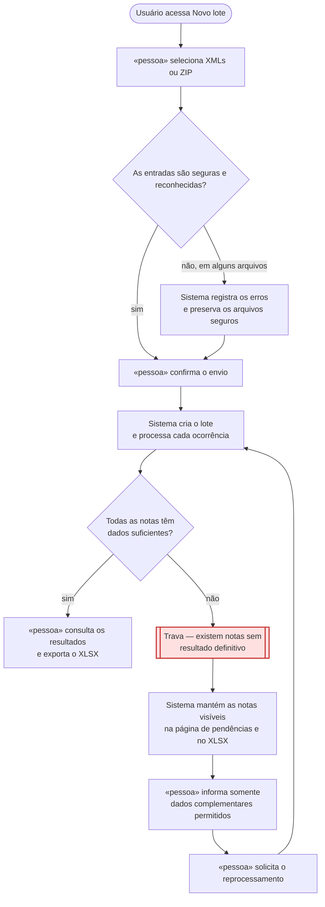
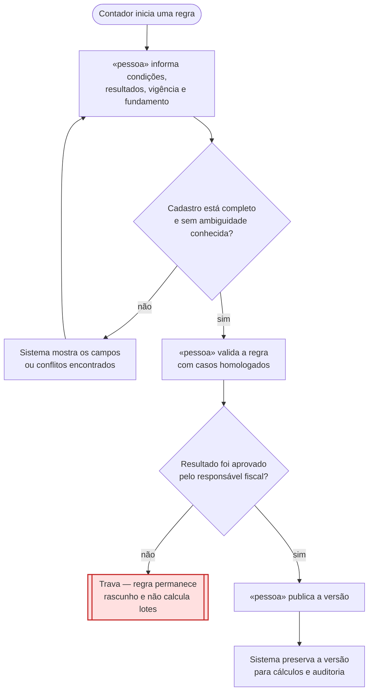

# Jornadas de Usuário

**Projeto:** Motor de Cálculo de ICMS
**Versão:** 0.1.0 — rascunho acadêmico
**Última atualização:** 16/09/2026

> Este documento descreve o que a pessoa vive durante as histórias mais críticas.
> Regras fiscais permanecem no PRD e em `regras-de-negocio.md`.

## Jornada 1 — Importar, processar e resolver um lote

**Stories:** US03 — Importar um lote; US05 — Investigar e resolver pendências
**Critérios que ela marca:** depende do tempo; pode ser abandonada no meio.

**O que decidimos sobre o nó vermelho:** quando faltam informações, o sistema não
inventa valores e não esconde a nota. Ele calcula apenas o que for possível,
mantém a ocorrência na página de pendências e a apresenta no XLSX com o aviso
“Informações faltando”. Enquanto a pendência não for resolvida, a nota não compõe
o total definitivo. O usuário pode voltar posteriormente, informar apenas os
campos autorizados e solicitar um novo cálculo; o XML original e a execução
anterior permanecem preservados.

## Jornada 2 — Publicar uma regra fiscal sem alterar o passado

**Story:** US02 — Criar e versionar regras fiscais
**Critérios que ela marca:** depende de outra pessoa agir; pode ser abandonada no meio.

**O que decidimos sobre o nó vermelho:** uma regra incompleta ou não homologada
permanece como rascunho e não participa da seleção usada pelos lotes. O contador
pode abandonar a edição e retomá-la depois, mas somente uma versão explicitamente
publicada e vigente pode afetar cálculos. Depois de publicada, uma correção cria
outra versão; o sistema não reescreve silenciosamente os resultados anteriores.

## Dúvidas em aberto

| # | Dúvida | Onde precisa ser resolvida |
| :--- | :--- | :--- |
| 1 | O lote deve retomar automaticamente após o aplicativo ser fechado durante o processamento? | Decisão de recuperação e persistência no roadmap |
| 2 | Quais campos ausentes podem ser complementados manualmente? | Política fiscal de complementação |
| 3 | Quem homologa formalmente uma regra quando houver mais de um usuário na instalação? | Evolução de atores e permissões |
